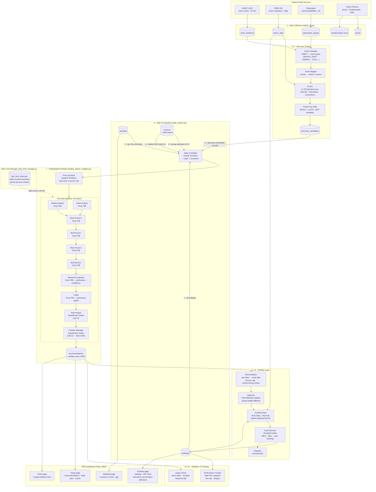

# Architecture — AI Financial Advisor

## Full pipeline diagram



---

## Component responsibilities

### Data layer

| File | Responsibility |
|------|---------------|
| `pipeline/gdelt_collector.py` | Downloads GDELT GKG 96×/day, computes mention velocity and tone trajectory per ticker |
| `pipeline/fred_collector.py` | Pulls 10 FRED series daily (VIX, T10Y2Y, Fed funds rate, CPI, HY spread, oil) |
| `pipeline/polymarket_collector.py` | Queries Polymarket every 6h, maps event probabilities to relevant tickers |
| `pipeline/price_collector.py` | Yahoo Finance OHLCV — 1 year on first fetch, 7 days on subsequent |
| `pipeline/fundamentals_cache.py` | Prefetches P/E, dividend yield, market cap for watchlist + holdings + recs |
| `pipeline/finbert_sentiment.py` | ProsusAI/FinBERT local model: scores GDELT summaries → `finbert_today`, `3d_avg`, `7d_avg` |

### Signal engine

| File | Responsibility |
|------|---------------|
| `pipeline/signal_engine.py` | Conviction score [0, 1] from 7 factors: momentum, sentiment, fundamentals, catalyst, macro alignment, volatility penalty, multi-confirm bonus |
| `pipeline/discovery/event_classifier.py` | GDELT theme tags → categorical events (MACRO_SHIFT, ENERGY, TECH_BREAKTHROUGH, …) |
| `pipeline/discovery/event_mapper.py` | Events → tickers + sectors (direct mention matching + sector affinity mapping) |
| `pipeline/discovery/scorer.py` | 0–100 score; applies penalty/cooldown rules to prevent churn on the same ticker |
| `pipeline/tax_filter.py` | Blocks US-domiciled ETFs; tags WHT rates and UCITS eligibility for Finnish MiFID II |

### LLM orchestration

| File | Responsibility |
|------|---------------|
| `analysis/trading_agents_wrapper.py` | 9-agent pipeline; key rotation; model fallback list; debate trace assembly |
| `analysis/rate_limit_manager.py` | Daily token/request counters; RPM throttle; dual-pool (daily20 / ondemand) isolation |

### Portfolio layer

| File | Responsibility |
|------|---------------|
| `portfolio/reconciliation.py` | Converts per-ticker decisions into a portfolio trade plan; enforces 10-position cap, 25% sector limit, 40% country limit, rotation logic |
| `portfolio/optimizer.py` | PyPortfolioOpt efficient frontier weights; fallback to equal weight when infeasible |
| `portfolio/portfolio_brain.py` | Market regime scoring (VIX + yield curve + credit spreads); conviction gate; Kelly sizing with regime multiplier; final brief |
| `portfolio/auto_executor.py` | Simulation execution: BUY/SELL updates holdings table, cash balance, monthly invest counter |
| `portfolio/holdings_monitor.py` | Thin wrapper: runs TradingAgents on held positions only, returns sell/hold signals |
| `portfolio/performance_tracker.py` | Daily snapshot of portfolio value; Sharpe, win-rate, max drawdown from completed recommendations |

---

## API budget flow

```
2 Groq keys × 100,000 tokens/day = 200,000 tokens/day
  └─ 16 tickers × ~4,000 tokens  =  64,000 tokens used  (32% of budget)

2 OR keys × 50 requests/day = 100 requests/day
  ├─ 89% → daily20 pool  = 89 requests  → 44 tickers/day capacity
  │   └─ Daily pipeline uses 32 (16 tickers × 2 calls)
  └─ 11% → ondemand pool = 11 requests  → 5 on-demand analyses via dashboard
```

---

## Market regime table

The Portfolio Brain adjusts confidence thresholds and position sizes based on macro conditions:

| Regime | Score | Min confidence | Position size |
|--------|-------|---------------|---------------|
| BULLISH | ≥ 60 | 60% (default) | 100% |
| NEUTRAL | 40–59 | 63% (+5%) | 85% |
| BEARISH | 25–39 | 69% (+15%) | 50% |
| RISK-OFF | < 25 | 78% (+30%) | 25% |

Inputs to regime score: VIX, T10Y2Y yield curve, HY credit spread, Fed funds rate, 5Y inflation expectations, GDELT global tone, Polymarket macro signals.

---

## Daily-16 selection priority

```
Priority  Slot             Source          Cap
────────────────────────────────────────────────
1         Holdings         holdings table  all (0–10)
2         Watchlist        watchlist table top 3 by conviction
3         Strong override  universe        conv ≥ 0.70, up to 3
4         Discovery        discovery_candidates  up to 2 (blocked if portfolio full)
5         Rotation fill    universe RANDOM → scored  remainder to reach 16
```

Rotation fill uses a 3× oversample from the universe then re-scores so the same low-signal tickers don't appear every day.
